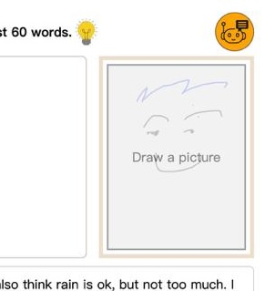

## Canvas Drawing Image Widget



## Overview

This widget implements a canvas drawing application. It allows users to create drawings, upload images, and manipulate them within a modal interface. The widget is modular, with various components handling different functionalities, including drawing on the canvas, uploading images, and managing user interactions.

In terms of widget usage, it works like an ordinary input field, except it is able to show image previews.

## Table of Contents

- [Canvas Drawing Image Widget](#canvas-drawing-image-widget)
- [Overview](#overview)
- [Table of Contents](#table-of-contents)
- [Key Features](#key-features)
- [Architecture](#architecture)
- [Components](#components)
  - [CanvasDrawingButtonView](#canvasdrawingbuttonview)
    - [Key Functions](#key-functions)
  - [CanvasDrawingModalFeatureMenuView](#canvasdrawingmodalfeaturemenuview)
    - [Key Functions](#key-functions-1)
  - [CanvasDrawingModalUploadImageView](#canvasdrawingmodaluploadimageview)
    - [Key Functions](#key-functions-2)
  - [CanvasDrawingModalDrawingCanvasView](#canvasdrawingmodaldrawingcanvasview)
    - [Key Functions](#key-functions-3)
  - [CanvasDrawing](#canvasdrawing)
    - [Key Functions](#key-functions-4)
- [Usage](#usage)
    - [draw or upload image, default placeholder](#draw-or-upload-image-default-placeholder)
    - [draw or upload image with placeholder written "Draw or insert a map"](#draw-or-upload-image-with-placeholder-written-draw-or-insert-a-map)
    - [draw only with empty placeholder](#draw-only-with-empty-placeholder)
    - [draw only with placeholder written "Draw here"](#draw-only-with-placeholder-written-draw-here)
    - [upload image only with placeholder written "Insert phto"](#upload-image-only-with-placeholder-written-insert-phto)
    - [Get value](#get-value)
    - [Set value](#set-value)
    - [Listen to value change](#listen-to-value-change)

## Key Features

- **Drawing on Canvas**: Users can draw using different brush styles and sizes.
- **Image Upload**: Users can upload images to be displayed on the canvas.
- **Undo/Redo Functionality**: Users can undo their last actions.
- **Responsive Design**: The canvas adapts to various screen sizes.

## Architecture

The widget is built using a modular approach, where each component is responsible for a specific part of the functionality. The main components are:

1. **CanvasDrawingButtonView**: Initializes the canvas drawing interface and manages image loading.
2. **CanvasDrawingModalFeatureMenuView**: Displays options for uploading images or drawing.
3. **CanvasDrawingModalUploadImageView**: Handles the image upload process.
4. **CanvasDrawingModalDrawingCanvasView**: Manages the drawing canvas and user interactions.
5. **CanvasDrawing**: Contains the drawing logic and canvas manipulation.

## Components

### CanvasDrawingButtonView

This component initializes the canvas drawing button and handles the click events to open modal menus for drawing and uploading images. It creates a placeholder for the image and manages the state of the loaded image.

#### Key Functions
- `initialize(node)`: Recursively initializes nodes with the `data-canvas-drawing-image` attribute.
- `implementNode(node)`: Sets up the drawing area and manages event listeners.

### CanvasDrawingModalFeatureMenuView

This modal presents options to the user, allowing them to either upload an image or start drawing. 

#### Key Functions
- `initialize({ domInput, onSelectUploadImage, onSelectCanvasDrawing, onClose })`: Displays the modal and handles user selections.

### CanvasDrawingModalUploadImageView

Handles the image upload process and displays a loading modal while the image is being uploaded.

#### Key Functions
- `initialize({ domInput, blobInput, onUpdate, onClose })`: Manages the upload flow, including file selection and processing.

### CanvasDrawingModalDrawingCanvasView

This modal contains the actual drawing canvas and tools for the user to draw with.

#### Key Functions
- `initialize({ domInput, imageWidthPx, imageHeightPx, clientWidth, clientHeight, imageData, onUpdate, onSave, onClose })`: Initializes the canvas and sets up drawing tools.

### CanvasDrawing

This component encapsulates the drawing logic, including brush styles, sizes, and the canvas state management.

#### Key Functions
- `initialize({ container, domInput, imageWidthPx, imageHeightPx, clientWidth, clientHeight, imageData, onUpdate, onSave, onClose })`: Sets up the drawing environment and handles user interactions.


--------

## Usage

#### draw or upload image, default placeholder
```html
<div data-canvas-drawing-image
data-image-width-px="640" data-image-height-px="480" 
style="height: 100%; aspect-ratio: 640/480;">
</div>
```

#### draw or upload image with placeholder written "Draw or insert a map"
```html
<div data-canvas-drawing-image
data-image-width-px="640" data-image-height-px="480" 
style="height: 100%; aspect-ratio: 640/480;">
    <div data-empty-image aria-hidden="true">
    Draw or insert a map
    </div>
</div>
```

#### draw only with empty placeholder
```html
<div data-canvas-drawing-image data-canvas-drawing-image-type="draw-only"
data-image-width-px="640" data-image-height-px="400" 
style="width: 100%; height: 100%;">
    <div data-empty-image>
    </div>
</div>
```

#### draw only with placeholder written "Draw here"
```html
<div data-canvas-drawing-image data-canvas-drawing-image-type="draw-only"
data-image-width-px="640" data-image-height-px="400" 
style="width: 100%; height: 100%;">
    <div data-empty-image>
        Draw here
    </div>
</div>
```

#### upload image only with placeholder written "Insert phto"
```html
<div data-canvas-drawing-image data-canvas-drawing-image-type="upload-image-only"
data-image-width-px="640" data-image-height-px="480" 
style="height: 100%; aspect-ratio: 640/480;">
    <div data-empty-image aria-hidden="true">
    Insert photo
    </div>
</div>
```


#### Get value
```javascript
const dom = document.querySelector('[data-canvas-drawing-image]');
console(dom.value); // print value
```


#### Set value
```javascript
const dom = document.querySelector('[data-canvas-drawing-image]');
dom.value = "https://...../image.png" // set value as image URL
dom.value = "data:image/jpeg;base64,........." // set value as data URL
```


#### Listen to value change
```javascript
const dom = document.querySelector('[data-canvas-drawing-image]');

dom.addEventListener("update", (e) => {
    console(e.target.value); // print value
});

dom.addEventListener("input", (e) => {   // same as update event
    console(e.target.value); // print value
});
```

